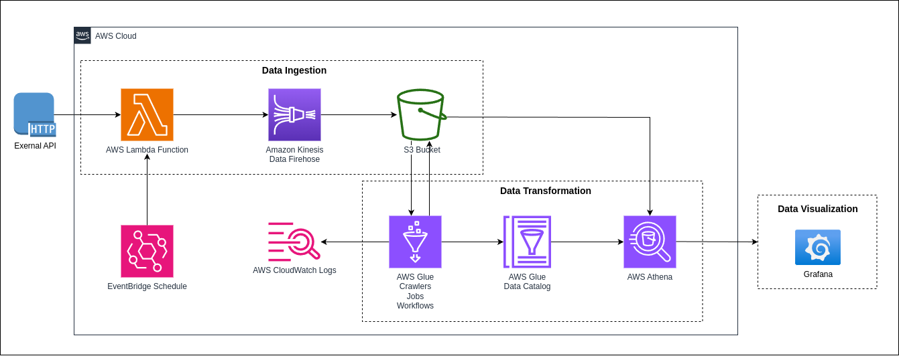
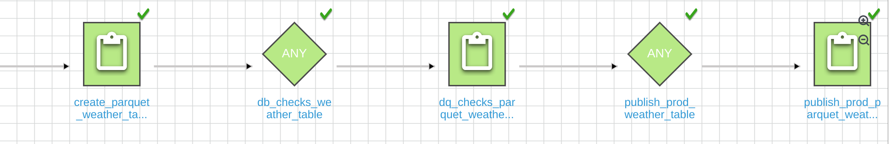
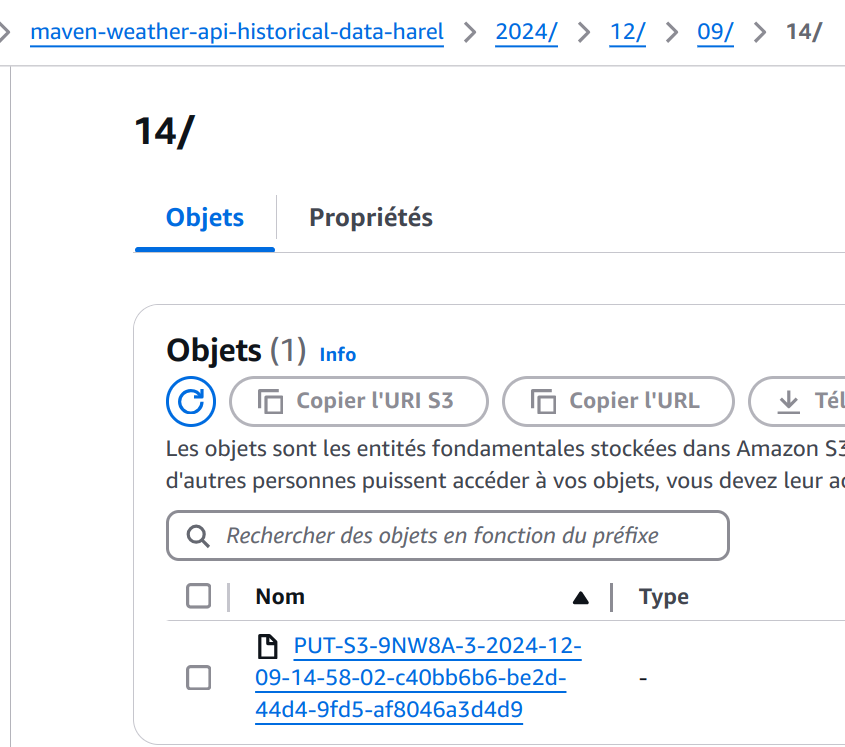
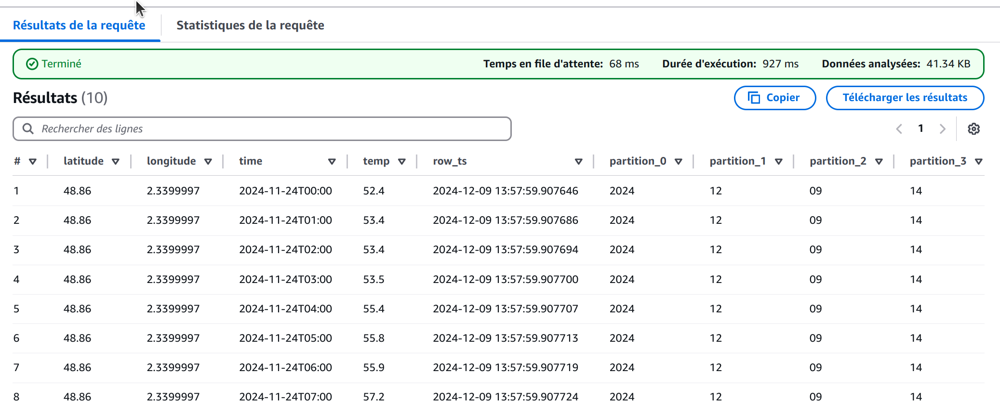
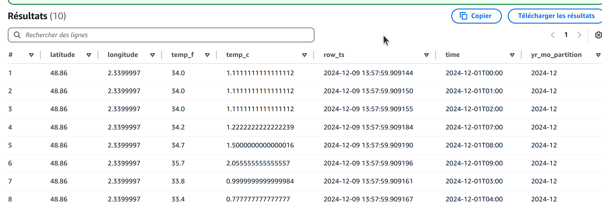
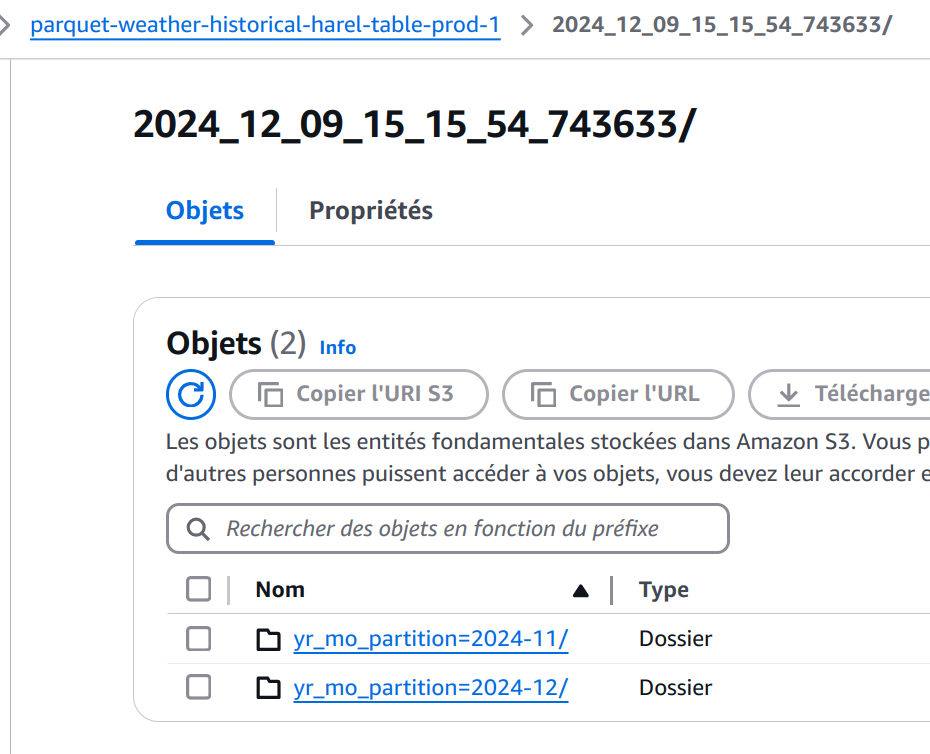
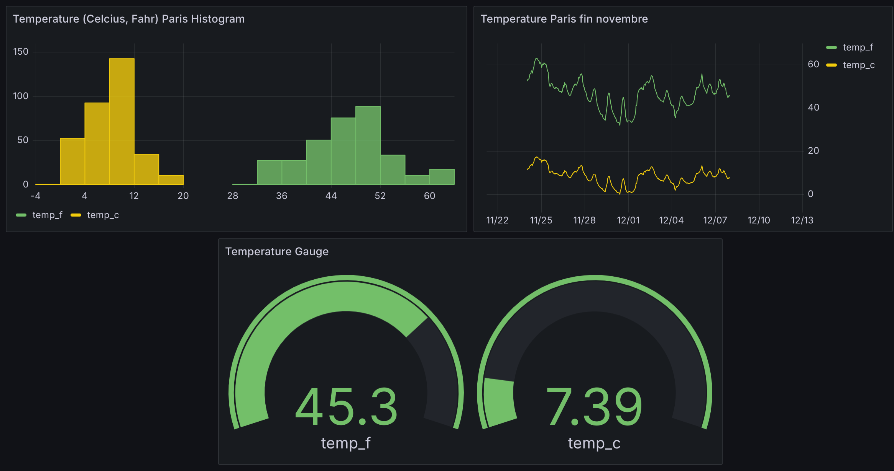

# openmeteo-API-to-AWS-Athena-to-Grafana
This project is an example of how to ingest Data from an API and automatically scale and partition data to an analytics database. 
Then data is accessed throughout a Grafana dashboard.

## Key Features
In this project data are gathered from an openmeteo API.  
The call is made on demand but could be configured to be scheduled easily with AWS EventBridge.   
So streaming or batch processing is not a topic.  
**The goal is to create analytics tables to create a Dashboard which can be queried without any cost**

Questions answered: 
- what is the evolution of the temperature during the last week of november 2024 in Paris ? It could be any other date range (more on that later)  
- what is the average temperature ?
</br>
</br>

## About the Dataset
The API documentation is here:  
https://open-meteo.com/en/docs/historical-forecast-api#start_date=2024-11-26   
An example of response:
```json
{
  "latitude": 48.86,
  "longitude": 2.3399997,
  "generationtime_ms": 10.577917098999,
  "utc_offset_seconds": 3600,
  "timezone": "Europe/Berlin",
  "timezone_abbreviation": "CET",
  "elevation": 39,
  "hourly_units": {
    "time": "iso8601",
    "temperature_2m": "°F"
  },
  "hourly": {
    "time": [
      "2024-11-24T00:00",
      "2024-11-24T01:00",
      "2024-11-24T02:00",
      "2024-11-24T03:00",
      "2024-11-24T04:00",
      "2024-11-24T05:00",
      ...
      ...
      "2024-12-07T18:00",
      "2024-12-07T19:00",
      "2024-12-07T20:00",
      "2024-12-07T21:00",
      "2024-12-07T22:00",
      "2024-12-07T23:00"
    ],
    "temperature_2m": [52.4, 53.4, 53.4, 53.5, 55.4, 55.8, ..., 46.3, 45, 44.8, 45.5, 45.8, 45.3]
  }
}
```
</br>
</br>

## Tech Stack
- Python
- AWS Lambda
- AWS IAM
- AWS Data Firehose
- AWS S3
- AWS Glue Crawler
- AWS Athena
- AWS Glue Jobs


- SQL
- Parquet format
- AWS Workflow
- AWS ClouWatch
- Grafana  
So the stack is centered around AWS.  

Advantages:
- Automatic scaling without having to configure servers and HA proxies
- Automatic partitioning (more on that later) in S3 and Athena
</br>
</br>

## Data Pipeline Architecture

</br>
</br>

## Data Transformation
The following choices have been made:
- Each Athena tables are "backed" temporarily by an S3 Bucket 
- Each SQL request results are "backed" by an S3 Bucket. 
- CSV files are transformed to Parquet file format to leverage its query performances.


</br>
Let's see step by step:  

1) The first step gets the partitioned data from S3:  
  
to Athena:

You can notice the partitions are the same.  
They were created without any line of code!

2) Deletion of the temporary S3 parquet bucket and parquet Athena table
3) Creation of a temporary S3 parquet bucket and parquet Athena table


</br>
You noticed a brand new partition column (yr_mo_partition) created by a python Glue Job
</br>

</br>

4) Data Quality checks on the parquet table is done    
5) When data Quality checks is Ok we create a prod table for a specific day and a new prod bucket


## Dashboard Preview
You can access it:
https://emmanuelharelgrafana.grafana.net/dashboard/snapshot/qnzYnGhLx3i5yMg7QP0kMlqCk1F4NMlE?orgId=1&from=2024-11-21T04:41:58.442Z&to=2024-12-13T01:23:29.297Z&timezone=browser
</br>   



</br>
</br>

## Future Improvements
- Pass the range of dates as an input to EventBridge to make the dashboard more flexible
- Add tests to the lambda function
- Add IAC, which is a big task
</br>
</br>


## What I learnt ?
- How to decouple a lambda to S3, to make writes to S3 scalable ?
- How to automatically generate S3 partitions from ingestion time ?
I have been part of a project where we had to write to HDFS some avro data. The partitioning (day/month/hour/minute) 
had to be done programatically
- How to write parquet files to Athena within a partitioned table
- How to plug a BI tool and avoid cost from scy rocking using a cache


